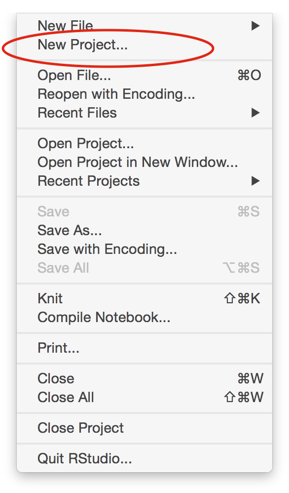
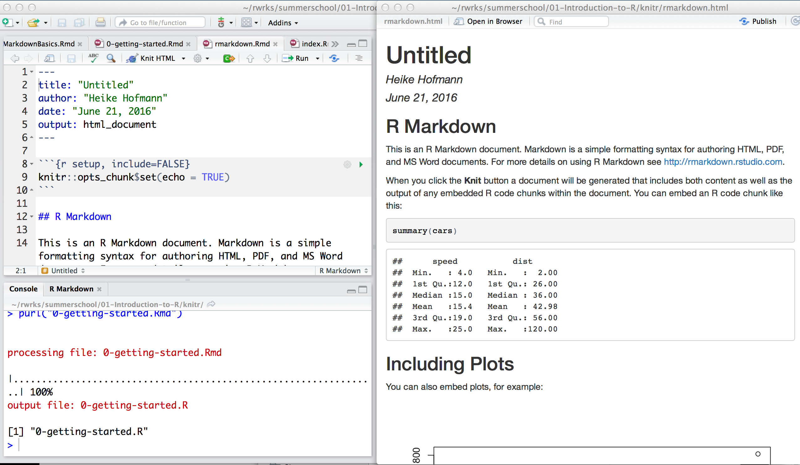

```{r setup, include = FALSE}
knitr::opts_chunk$set(
  message = FALSE,
  cache = FALSE,
  fig.height = 2,
  fig.width = 5,
  collapse = TRUE,
  comment = "#>"
)
```

# What is R? ... and what does it do?

## R  is ...

* <blockquote> a language and environment for statistical computing and graphics
</blockquote>
* with python most commonly used data science software (52.1% versus 52.6%) [kdnuggets](http://www.kdnuggets.com/2017/05/poll-analytics-data-science-machine-learning-software-leaders.html)

## R is ...

```{r, eval = TRUE, echo = FALSE}
# devtools::install_github("metacran/crandb")
pkgs <- crandb::list_packages(limit = 999999)
num_pkgs <- length(pkgs)
```

* __Free__ to use
* __Extensible__
    * `r num_pkgs` user contributed add-on packages currently on [CRAN](https://cran.r-project.org/) (The Comprehensive R Archive Network) (as of `r Sys.Date()`)
    * at least as many packages on github repositories
* __Powerful__
    * With the right tools, get more work done, faster.
* __Flexible__
    * Not a question of _can_, but _how_.
* __Frustrating__
    * Flexibility comes at a cost (easy to shoot yourself in the foot!).


## R does ...

* __Graphics, statistics, machine learning, etc.__
* __Data acquisition, munging, management__
* __Literate programming (dynamic reports)__
* __Web applications__

We will touch on all of these aspects.
Slides and material are available at
 http://heike.github.io/summerschool-2017

#  http://heike.github.io/summerschool-2017

## Installing R

- Go to [http://www.r-project.org/](http://www.r-project.org/)
- Click the CRAN link on the left, and pick a download site (0-Cloud is a good choice)
- Choose link based on your OS
- On Windows, choose the "base" subdirectory to install R.
- On OS X, choose the .pkg file to install R.

## Installing RStudio

- Browse to [https://www.rstudio.com/](https://www.rstudio.com/)
- Mouse over Products and click RStudio
- Choose RStudio Desktop
- Click Download RStudio Desktop
- Choose the installer appropriate for your platform


## RStudio is ...

[From Julie Lowndes](http://jules32.github.io/resources/RStudio_intro/):  

<blockquote>
<b>If R were an airplane, RStudio would be the airport</b>, providing many, many supporting services that make it easier for you, the pilot, to take off and go to awesome places. Sure, you can fly an airplane without an airport, but having those runways and supporting infrastructure is a game-changer.
</blockquote>

## The RStudio IDE

<div class="columns-2">
1. Source editor
    - Docking station for multiple files
    - Useful shortcuts ("Knit")
    - Highlighting/Tab-completion
    - Code-checking (R, HTML, JS)
    - Debugging features
2. Console window
    - Highlighting/Tab-completion
    - Search recent commands
3. Other tabs/panes
    - Graphics
    - R documentation
    - Environment pane
    - File system navigation/access
    - Tools for package development, git, etc
<div>


## Create a project

Create a project to contain all of the material covered in this set of tutorials:

* File -> New Project -> New Directory -> Empty Project

 

## Hello R Markdown!

* File -> New File -> R Markdown -> OK -> Knit HTML

<div align="center">
  
</div>

## What is R Markdown?

- From the [R Markdown home page](http://rmarkdown.rstudio.com/):

<blockquote>
R Markdown is an authoring format that enables easy creation of dynamic documents, presentations, and reports from R. It combines the core syntax of __markdown__ (an easy-to-write plain text format) __with embedded R code chunks__ that are run so their output can be included in the final document. R Markdown documents are fully reproducible (they can be automatically regenerated whenever underlying R code or data changes).
</blockquote>

- RStudio's [cheatsheet](https://www.rstudio.com/wp-content/uploads/2015/02/rmarkdown-cheatsheet.pdf) gives a nice, concise overview of its capabilities.

- RStudio's [reference guide](https://www.rstudio.com/wp-content/uploads/2015/03/rmarkdown-reference.pdf) lists its options.

## Following along

- [Go to github repo](https://github.com/heike/summerschool-2017) for all materials. 

- [Download](knitr/0-getting-started.Rmd) and open the document which generates these slides in RStudio (you can do that with this R code):


```{r, eval = FALSE}
curl::curl_download(
  "https://raw.githubusercontent.com/heike/summerschool-2017/master/01-Introduction-to-R/knitr/0-getting-started.Rmd",
  "0-getting-started.Rmd"
)
file.edit("0-getting-started.Rmd")
```

- [Download](knitr/0-getting-started.R), save, and open the corresponding R script.

```{r, eval = FALSE}
curl::curl_download(
  "https://raw.githubusercontent.com/heike/summerschool-2017/master/01-Introduction-to-R/code/0-getting-started.R",
  "0-getting-started.R"
)
file.edit("0-getting-started.R")
```

## Error message?

If R is complaining about not having the package `curl`, run

```{r, eval= FALSE}
install.packages("curl")
```

and try again
