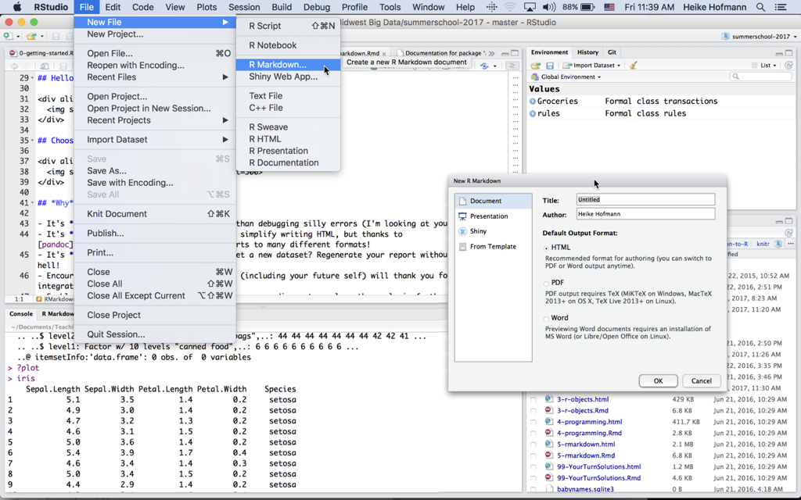

## R Markdown

We have been using R markdown in the slides all along, so now we take a closer look at different formats and parameters


Follow along (copy & paste the code into the console):
```{r, eval = FALSE}
curl::curl_download(
  "https://raw.githubusercontent.com/heike/rwrks/gh-pages/summerschool/01-Introduction-to-R/knitr/5-rmarkdown.Rmd",
  "5-rmarkdown.Rmd"
)
file.edit("5-rmarkdown.Rmd")
```

## Hello R Markdown!

<div align="center">
  
</div>

## Choose your output format!

<div align="center">
  
</div>

## *Why* R Markdown?

- It's **simple**. Focus on writing, rather than debugging silly errors (I'm looking at you *LaTeX*).
- It's **flexible**. Markdown was created to simplify writing HTML, but thanks to [pandoc](http://pandoc.org/), Markdown converts to many different formats!
- It's **dynamic**. Find a critical error? Get a new dataset? Regenerate your report without copy/paste hell!
- Encourages **transparency**. Collaborators (including your future self) will thank you for integrating your analysis & report.
- Enables **interactivity/reactivity**. Allow your audience to explore the analysis (rather than passively read it).

## First things first, *what* is Markdown?

- Markdown is a particular type of markup language.
- Markup languages are designed to produce documents from plain text.
- Some of you may be familiar with *LaTeX*. This is another (less human friendly) markup language for creating pdf documents.
- *LaTeX* gives you much greater control, but it is restricted to pdf and has a **much** greater learning curve.
- Markdown is becoming a standard. Many websites will generate HTML from Markdown (e.g. GitHub, Stack Overflow, reddit).

## *Who* is using R Markdown, and *for what*?

* The [R Markdown website](http://rmarkdown.rstudio.com/) is built with R Markdown.
* The [new edition of the ggplot2 book](https://github.com/hadley/ggplot2-book/) uses it.
* R package vignettes (for example, [I made this for plotly](http://cpsievert.github.io/plotly/pipe-dsl/)).
* [Many](http://lincolnmullen.com/projects/dh-r/index.html) great [tutorials](http://renkun.me/learnR/) use R markdown add-ons such as [Rgitbook](http://jason.bryer.org/Rgitbook/).
* People are blogging with it.

## What is *R* Markdown?

* Straight from the [R Markdown home page](http://rmarkdown.rstudio.com/):

> R Markdown is an authoring format that enables easy creation of dynamic documents, presentations, and reports from R. It combines the core syntax of **markdown** (an easy-to-write plain text format) **with embedded R code chunks** that are run so their output can be included in the final document. R Markdown documents are fully reproducible (they can be automatically regenerated whenever underlying R code or data changes).

## Your Turn {data-background=#527a7a}

Study the first page of the [R Markdown Reference Guide](https://www.rstudio.com/wp-content/uploads/2015/03/rmarkdown-reference.pdf). 

Yes, the *entire* markdown syntax can be described in one page!

Can you think of anything that is missing from the syntax (that you might want when creating documents)?

## Markdown doesn't natively support...

- unfortunately quite a lot ... :
    * Figure/table referencing (Well, sort of... you can use it for pdfs)
    * ~~Table of contents~~ (Support added recently!)
- Many, many appearance related things (image/figure alignment, coloring, font families, etc.) 

## There is hope...

- You don't *have to* restrict yourself to markdown. You can always include HTML/`LaTeX` markup, but don't expect it to convert between output formats.
- There are many efforts to extend Markdown (but, then again, keeping it simple is the point!)
- More features are being added almost daily
- Templates are being created

## Your Turn {data-background=#527a7a}

Have a look at R Markdown presentations and templates.

<div align="center">
  
</div>

**Pro tip**: run `devtools::install_github("rstudio/rticles")` to get more templates

## Yaml Front Matter

The stuff at the top of the .Rmd file (called yaml front matter) tells **rmarkdown** what output format you want. 

```
---
title: "Untitled"
date: "June 21, 2016"
output: html_document
---
```

In this case, when you click "Knit HTML", RStudio calls `rmarkdown::render("file.Rmd", html_document())`. You can certainly change these default values (see the [source of this presentation](https://raw.githubusercontent.com/heike/rwrks/gh-pages/summerschool/01-Introduction-to-R/knitr/5-rmarkdown.Rmd)).

## What is a code chunk?

A code chunk is a concept borrowed from the [knitr](http://yihui.name/knitr/) package (which, in turn, was inspired by [literate programming](http://en.wikipedia.org/wiki/Literate_programming)). In .Rmd files, you can start/end a code chunk with three back-ticks.

```{r chunk1, verbatim = TRUE}
1 + 1
```

Want to run a command in another language?

```{r chunk2, engine = 'python', verbatim = TRUE}
print "a" + "b"
```

## Code chunk options

There are a plethora of [chunk options](http://yihui.name/knitr/options/) in **knitr** (engine is one of them). Here are some that I typically use:

* `echo`: Show the code?
* `eval`: Run the code?
* `message`: Relay messages?
* `warning`: Relay warnings?
* `fig.width` and `fig.height`: Change size of figure output.
* `cache`: Save the output of this chunk (so we don't have to run it next time)?

## Your Turn {data-background=#527a7a}

Study the second page of the [R Markdown Reference Guide](https://www.rstudio.com/wp-content/uploads/2015/03/rmarkdown-reference.pdf) and go back to the Hello R Markdown example we created.

**Easy**: Modify the figure sizing and alignment.

**Medium**: Add a figure caption.

**Hard**: Can you create an animation? (Hint: look at the `fig.show` chunk option -- you might need to the **animation** package for this)

**Pro Tip**: Don't like the default chunk option value? Change it at the top of the document:

```{r setup, verbatim = TRUE}
knitr::opts_chunk$set(message = FALSE, warning = FALSE)
```

## Formatting R output

```{r}
m <- lm(mpg ~ disp, data = mtcars)
summary(m) # output isn't very attractive
```

---

[pander](http://rapporter.github.io/pander/) is one great option.

```{r}
library(pander)
pander(m)
```

---

```{r}
a <- anova(m)
a
```

---

```{r}
pander(a)
```

## Pander knows about a lot of different methods!

```{r}
methods(pander)
```

## Your Turn {data-background=#527a7a}

* Look through the list of pander methods. Can you apply any of the methods that we haven't discussed? We just saw `pander.lm` and `pander.anova`.
